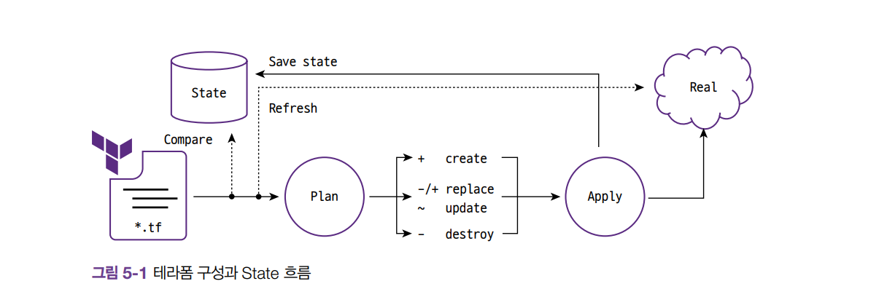
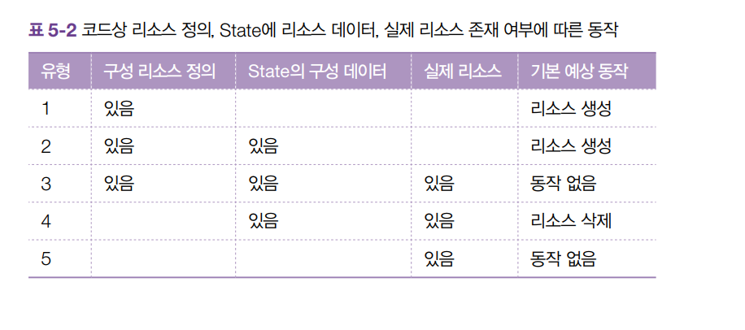

# 5. State

> 테라폼은 Stateful application 이다.

상태를 저장하고 프로비저닝한 모든 내용을 저장한 상태로 추적한다. 

* terraform.tfstate 파일에 Json 형태로 저장
* 리소스 생성, 수정, 삭제에 대한 판단작업을 수행

## State 목적과 의미

* `terraform apply`
    * State에는 테라폼 구성과 실제를 동기화하고 각 리소스에 고유한 아이디로 맵핑
    * 리소스 종속성과 같은 메테데이터를 저장하고 추적
    * 테라폼 구성으로 프로비저닝된 결과를 캐싱하는 역할을 수행

```.json
# Create a VPC
resource "aws_instance" "app_server" {
  ami = data.aws_ami.amzn2.id
  instance_type = "t3.micro"
  ...
}

```

```.json
 "resources": [
    {
      "mode": "data",
      "type": "aws_ami",
      "name": "amzn2",
      "provider": "provider[\"registry.terraform.io/hashicorp/aws\"]",
      "instances": [
        {
            ...
        }
      ]
    }
 ]
```

## State 동기화



### 동작별 유형



## workspace
terraform init, apply 수행해 

```.ps 
PS D:\terraform> terraform workspace list
* default

```

```
PS D:\terraform> terraform workspace new devworkspace
Created and switched to workspace "devworkspace"!

You're now on a new, empty workspace. Workspaces isolate their state,
so if you run "terraform plan" Terraform will not see any existing state
for this configuration.

PS D:\terraform> terraform workspace show  
devworkspace
```


```
# Create a VPC
resource "aws_instance" "app_server" {
  count = "${terraform.workspace == "default" ? 5:2}"
  ...
}

## PS D:\terraform> terraform plan
## Plan: 2 to add, 0 to change, 0 to destroy.
```

