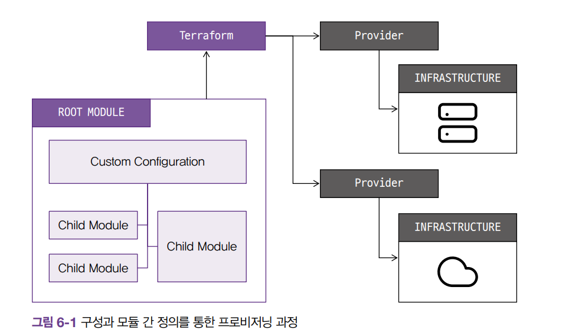

# 모듈

* 단일 파일 구조상 단점
    * 구성에서 원하는 항목을 찾고 수정하는 것이 어려워짐
    * 변경 작업의 영향도를 분석하기 어려워짐
    * 개발/스테이징/프로덕션 환겨으로 구분된 경우 비슷한 형태의 구성이 반복되어 업무 효율이 줄어듬
    * 새로운 프로젝트 구성 시, 기존 구성과 종속성 파악이 어려움



* Root Module : 테라폼을 실행하고 프로비저닝하는 최상위 모듈
* Child Module : 루트 모듈의 구성에서 호출되는 외부 구성의 집합 

[Network and credit specification example](https://registry.terraform.io/providers/hashicorp/aws/latest/docs/resources/instance#network-and-credit-specification-example)

```
PS D:\terraform\note\ch6-module\modules\terraform-random-pwgen> terraform apply -auto-approve -var=isDB=true

Terraform used the selected providers to generate the following execution plan. Resource actions are
indicated with the following symbols:
  + create


Terraform will perform the following actions:

  # random_password.password will be created
  + resource "random_password" "password" {
      + bcrypt_hash      = (sensitive value)
      + id               = (known after apply)
      + length           = 16
      + lower            = true
      + min_lower        = 0
      + min_numeric      = 0
      + min_special      = 0
      + min_upper        = 0
      + number           = true
      + numeric          = true
      + override_special = "!@#$%?"
      + result           = (sensitive value)
      + special          = true
      + upper            = true
    }

  # random_pet.name will be created
  + resource "random_pet" "name" {
      + id        = (known after apply)
      + keepers   = {
          + "ami_id" = (known after apply)
        }
      + length    = 2
      + separator = "-"
    }

Plan: 2 to add, 0 to change, 0 to destroy.

Changes to Outputs:
  + id = (known after apply)
  + pw = (known after apply)
random_pet.name: Creating...
random_pet.name: Creation complete after 0s [id=fresh-mammoth]
random_password.password: Creating...
random_password.password: Creation complete after 0s [id=none]

Apply complete! Resources: 2 added, 0 changed, 0 destroyed.

Outputs:

id = "fresh-mammoth"
pw = "36M!ajrT9VfnzeEk"
```