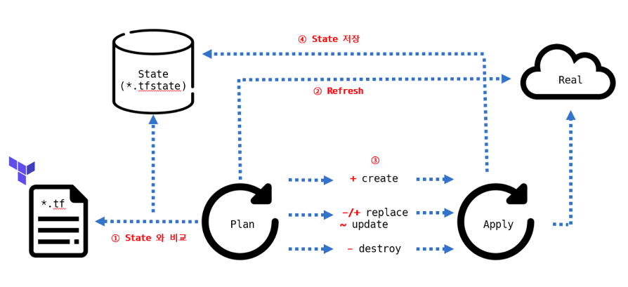

## Chap5 state

- 테라폼은 상태가 있는, Stateful 애플리케이션이다
- 프로비저닝 결과에 따른 State 를 저장하고 추적한다
- 로컬 환경에서는 JSON 형태로 terraform.tfstate 파일에 저장됨  
  팀/조직의 경우에는 공동 관리를 위해 원격 저장소에서 관리
- State 에는 **작업자가 정의한 코드와 실제 반영된 프로비저닝 결과**를 저장함

---

### State 목적과 의미

state 의 역할
- 테라폼 구성과 실제를 동기화, 각 리소스에 고유한 아이디로 매핑
- 리소스 종속성과 같은 메타 데이터를 저장 및 추적
- 프로비저닝된 결과를 캐싱하는 역할


state 예시
```json
{
  "version": 4,
  "terraform_version": "1.9.6",
  "serial": 1,
  "lineage": "41d194db-31cf-fbbd-9d8d-a473d3434079",
  "outputs": {},
  "resources": [
    {
      "mode": "managed",
      "type": "random_password",
      "name": "pwd",
      "provider": "provider[\"registry.terraform.io/hashicorp/random\"]",
      "instances": [
        {
          "schema_version": 3,
          "attributes": {
            "bcrypt_hash": "$2a$10$QGgnky75vSko39qNbGV3MuPuO1aHfOtBgiyhPQxGiaRHyOafksXQe",
            "id": "none",
            "keepers": null,
            "length": 16,
            "lower": true,
            "min_lower": 0,
            "min_numeric": 0,
            "min_special": 0,
            "min_upper": 0,
            "number": true,
            "numeric": true,
            "override_special": "!#$%",
            "result": "TUtj23h$ykAlAh19",
            "special": true,
            "upper": true
          },
          "sensitive_attributes": [
            [
              {
                "type": "get_attr",
                "value": "result"
              }
            ],
            [
              {
                "type": "get_attr",
                "value": "bcrypt_hash"
              }
            ]
          ]
        }
      ]
    }
  ],
  "check_results": null
}
```

refresh 옵션
- plan 실행 시, 자동으로 실제 생성 대상(클라우드 등) 과 state 를 기준으로 비교하는 refresh 동작이 실행됨
- -refresh=false 플래그를 통해 동기화 과정 생략 가능 -> 이는 대량의 리소스를 관리해야하는 경우, 시간절감의 효과

---


### State 동기화

기존 state 와 구성을 비교하여 실행계획에서의 생성,수정,삭제 여부를 결정함


image by https://nali.tistory.com/385

리소스에 발생할 수 있는 사항
1. Create
2. Destroy
3. Replace
4. Update in-place

각 유형별 동작
1. 신규 리소스 정의 -> Apply 수행  = 리소스 생성
2. 구성 파일 리소스 존재 & State 에 리소스 존재 but 실제 리소스 부재 = 리소스 생성
    이와 같은 경우는 사용자가 수동으로 인프라 삭제한 경우임

3. 구성 파일 리소스 존재 & State 에 리소스 존재 & 실제 리소스 존재 = 변경 계획 없음
4. 구성 파일 리소스 부재 & State 에 리소스 존재 & 실제 리소스 존재 = 리소스 삭제
5. 실제 리소스만 존재한다면 = 해당 리소스에 대해 아무 작업도 할 수 없다
    테라폼으로 관리되지 않는 리소스라는 의미

---

### 워크스페이스

- state 를 관리하는 논리적인 가상 공간인 워크스페이스  
- 구성 파일은 동일하지만, 서로 다른 state를 가지는 실제 대상을 프로비저닝 할 수 있음  
- 워크 스페이스는 기본 default

사용법

```
사용중인 워크스페이스 확인 
terraform workspace list

워크스페이스 생성
terraform worspace new myWorkSpace1

현재 사용중인 워크스페이스 확인
terraform workspace show

워크스페이스 선택
terraform workspace select default

워크스페이스 삭제
terraform workspace delete myWorkSpace1
```

- 워크스페이스 생성시 terraform.tfstate.d 디렉토리 생성됨
- apply 시에, 해당 디렉토리에 state 파일 생성됨

장점
- 하나의 루트 모듈에서, 다른 환경을 위한 리소스를 동일한 구성파일로 관리
- 기존 환경 영향 없이 변경사항 실험 가능
- 깃의 브랜치 전략과 유사. 동일한 구성 파일에서 서로 다른 리소스 결과 관리

단점
- 테라폼 구성 파일에 분기 처리가 다수 존재
- 프로비저닝 대상에 대한 인증 요소를 완벽히 분리가 어려움
- State 접근 권한 관리가 불가능
