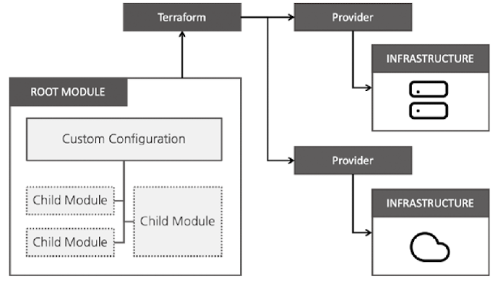
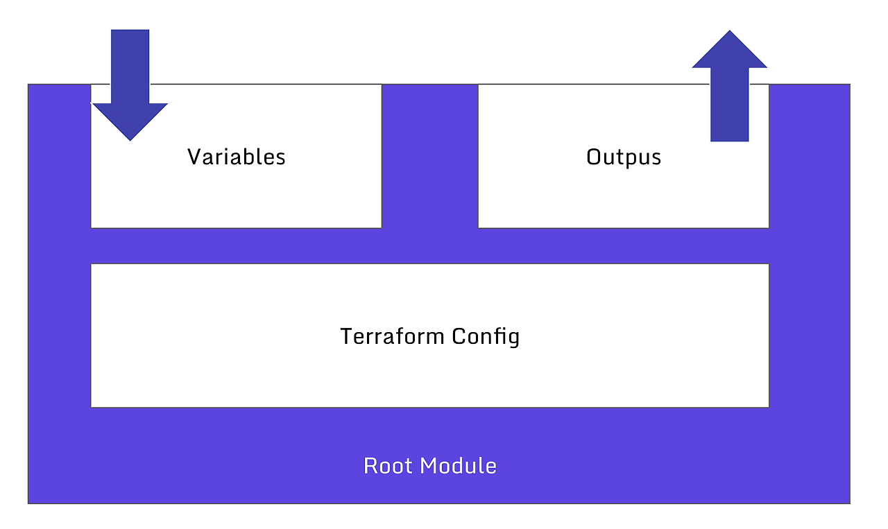
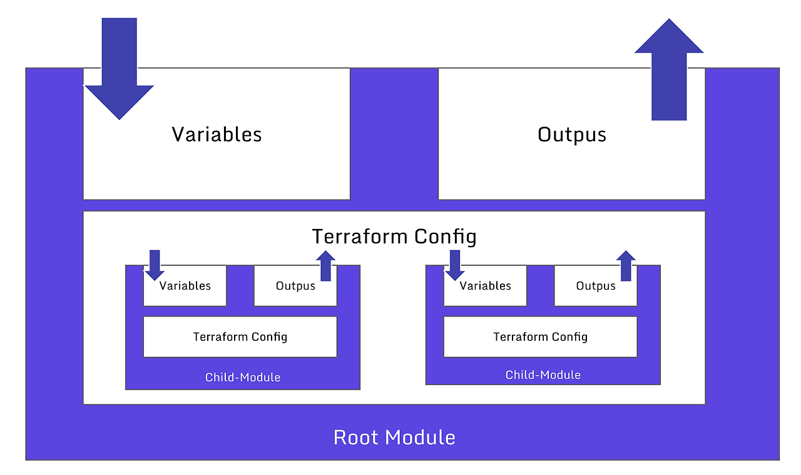

# Chap6 모듈

- 테라폼으로 인프라를 관리하면, 시간이 지날수록 구성이 복잡해짐
- 단일 파일 구조상에서 지속적 업데이트 가능하지만, 다음과 같은 문제점들 존재
1. 원하는 항목 찾고, 수정이 어려워짐
2. 리소스 간의 연관관계가 복잡해질수록, 영향도 분석을 위한 노력이 필요함
3. 개발/스테이징/운영 환경으로 구분한 경우, 비슷한 형태의 구성이 반복됨
4. 새로운 프로젝트 구성시, 기존 구성에서 가져와야 할 구성과 종속성 파악이 어려움

---


img by https://leehosu.tistory.com/entry/T101-5-1-Terraform-module


모듈은 루트모듈과 자식모듈
- 루트 모듈 : 테라폼 실행, 프로비저닝 하는 최상위 모듈
- 자식 모듈 : 루트모듈 구성에서 호출하는 외부 구성 집합

모듈의 장점
- 관리성 : 서로 연관되어 있는 구성의 묶음. 쉽게 찾고 업데이트 가능.
- 캡슐화 : 각 모듈은 독립적으로 프로비저닝 및 관리 됨. 그 결과는 은닉성을 갖춰 필요한 부분만 노출.
- 재사용성 : 이후 비슷한 프로비저닝에 이미 작성되어 실행된, 즉 검증된 구성을 바로 사용 가능
- 일관성, 표준화 : 모듈을 사용하는 워크플로우는 구성의 일관성 제공. 서로 다른 환경에서도 이미 검증된 모듈을 적용해 복잡한 구성과 보안사고를 방지할 수 있음.

---

### 모듈 작성 기본 원칙

모듈은 라이브러리, 패키지와 역할이 비슷

기본 작성 원칙
- 디렉터리 형식 `terraform - 프로바이더이름 - 모듈이름`
- 궁극적으로 모듈화가 가능한 구조로 작성하자
- 각각의 모듈은 독립적으로 관리하기. 루트 모듈의 하위 파일 시스템에 두는 것이 아닌, 독립적인 모듈이므로 동일한 파일 시스템 레벨에 두자
- 공개된 테라폼 레지스트리의 모듈을 참고하자
- 작성된 모듈은 팀 또는 커뮤니티와 공유하자


모듈의 디렉토리 구조 예시
```
terraform
|- modules
|  ㄴ main.tf
|  ㄴ output.tf
|  ㄴ variable.tf
ㄴ- root
   ㄴ main.tf

```

---

### 모듈화해보기

모듈의 기본 구조

img by https://leehosu.tistory.com/entry/T101-5-1-Terraform-module
- 모듈화 라는 용어는 이런 구조를 재활용하기 위한 템플릿 작업을 의미함

루트모듈과 자식모듈

img by https://leehosu.tistory.com/entry/T101-5-1-Terraform-module
- 모듈은 다른 모듈을 참조해 사용 가능 
- 사용방식은 리소스와 비슷. 참조 모듈이 필요한 값은 variable 로 설정. 참조 모듈이 생성한 값은 output으로 설정.


실습
- random_pet 은 이름 자동 생성
- random_pawssword 는 사용자 패스워드 설정
```
terraform
|- modules
|  ㄴ random-pwgen
|       ㄴ main.tf
|       ㄴ output.tf
|       ㄴ variable.tf
ㄴ- root
   ㄴ main.tf

```

- 자식 모듈을 호출하는 루트 모듈의 정의 예제

```
module "mypw1" {
  source = "../modules/random-pwgen"
}

module "mypw2" {
  source = "../modules/random-pwgen"
  isDB = true
}

output "mypw1" {
  value = module.mypw1
}

output "mypw2" {
  value = module.mypw2
}

```

- 모듈 결과 참조 형식은 `module.<모듈이름>.<output이름>`
- .terraform/modules/modules.json 파일에서 정의 확인 가능 

---

### 모듈 사용 방식

- 모듈에서 사용되는 모든 리소스는 관련 프로바이더의 정의가 필요함  
- 이떄 프로바이더 정의를 모듈 안에 두어야 할지, 밖에 두어야 할지 고민 될 수 있음


1. 자식모듈에서 프로바이더 정의
- 프로바이더 버전과 구성 상세를 자식모듈에 고정하는 방식
- 프로바이더 버전과 구성에 민감한 경우 설정
- 하지만, 버전조건 합의가 안되면, 오류가 발생하기에 잘 사용 안 함. 반복문도 사용 못함

2. 루트 모듈에서 프로바이더 정의
- 프로바이더 모듈 내 리소스와 데이터 소스에 일괄 적용
- 자식 모듈에 대한 반복문 사용에 자유로움

실습(자식 모듈)
```
# main.tf
terraform {
    required_providers {
        aws = {
            source = "hashicorp/aws"
        }
    }
}

resource "aws_default_vpc" "default" {}

data "aws_ami" "default" {
    most_recent = true
    owners = ["amazon"]

    filter {
        name = "owner-alias"
        values = ["amazon"]
    }

    filter {
        name = "name"
        values = ["amzn2-ami-hvm*"]
    }
}

resource "aws_instance" "default" {
    depends_on = [aws_default_vpc.default]
    ami = data.aws_ami.default.id
    instance_type = var.instance_type

    tags = {
        Name = var.instance_name
    }
}

# variable.tf
variable "instance_type" {
    description = "vm 인스턴트 타입"
    default = "t3.micro"
}

variable "instance_name" {
    description = "vm 인스턴스 이름 정의"
    default = "my_ec2"
}

# output.tf
output "private_ip" {
    value = aws_instance.default.private_ip
}
```

실습(루트모듈)

```
# main.tf

provider "aws" {
    region = "us-west-1"
}

provider "aws" {
    region = "seoul"
    region = "ap-northeast-2"
}

module "ec2_california" {
    source = "../moduels/terraform-aws-ec2"
}

module "ec2_seoul" {
    source = "../moduels/terraform-aws-ec2"
    provider = {
        aws = aws.seoul
    }
    instance_type = "m5.large"
}

```

---

### 모듈 소스 관리

- module 블록의 source 구성으로, 모듈의 코드 위치를 정의함
- init 을 할때, 지정된 모듈을 다운로드해서 사용하기도 함(이전까지는 로컬 활용)

소스 유형
- 로컬 디렉토리 경로
- 테라폼 레지스트리
- 깃허브
- 비트버킷
- 깃
- HTTP URLs
- S3
- GCS


